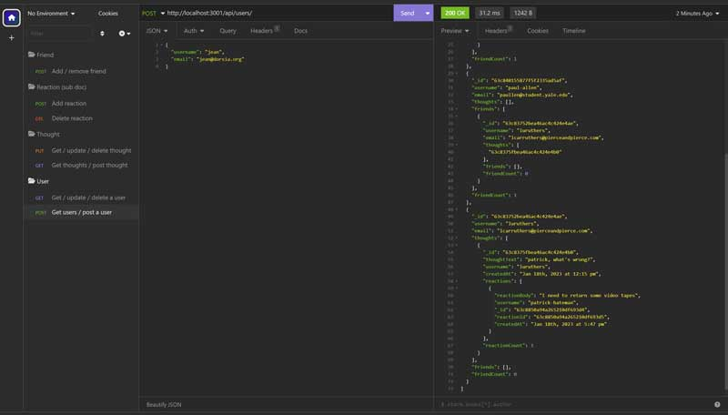

# social-network

  * [Repo](https://github.com/escowin/social-network)

## Description

  An API backend built with the noSQL database MongoDB.
  
  Using the Mongoose ODM,  User & Thought models have full REST API functionality. Routes are modularizes for code scaling & legibility. Reactions are subdocuments within a Thought document.
  
  Virtuals are used to track counts, and getters are used to reformat timestamps on Thoughts and Reactions. 

## Languages

    ES6 Javascript, Node.js, Express.js, Mongoose, MongoDB

## Table of Contents

  * [Installation](#installation)

  * [Screenshot](#screenshot)

  * [Author](#author)

## Installation

  Run the following command to install necessary dependencies:

  ```
  npm i
  ```

## Screenshot




## Author

  Edwin M. Escobar

  * [Email](mailto:edwin@escowinart.com)

  * [GitHub](https://github.com/escowin)
